A. Pre-Requirements
1. Postgres Image OR PostgreSQL in local
2. DBT for data transformation
3. Metabase Image for data visualization

B. Prepare Dataset and Schema
1. Download dataset https://www.kaggle.com/datasets/olistbr/brazilian-ecommerce and extract into your local computer.
2. Create database schema based on dataset (filename: **ddl.sql**)
3. (Optional) Create ER Diagram, open https://dbdiagram.io/ in browser and paste **erd.io**
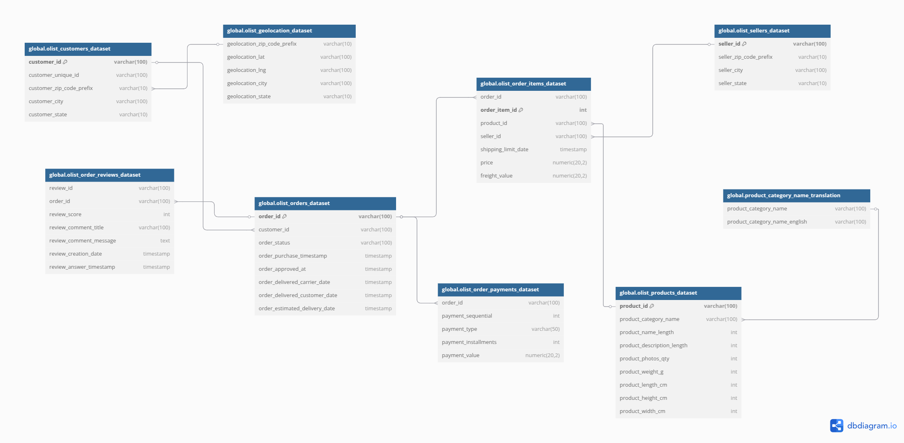

C. Setup PostgreSQL Container and Import CSV Dataset
1. Pull Postgres Image from https://hub.docker.com/, I've already install PostgreSQL 12.
- If you don't have Postgres Image, pull from terminal using command: `docker pull postgres:12`
- Run PostgreSQL container using command: `docker run --name postgres-retail -e POSTGRES_USER=user1 -e POSTGRES_PASSWORD=12345##12345 -e POSTGRES_DB=brazilian_ecommerce -p 1818:5432 -d postgres:12`
##### Setup can be customized
- container_name: postgres-retail
- POSTGRES_USER: user1
- POSTGRES_PASSWORD: 12345##12345
- POSTGRES_DB: brazilian_ecommerce
- port: 1818
##### Ensure the container running succesfully with command: `docker ps`
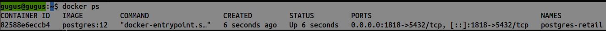
2. Login into PostgreSQL Container using command: `docker exec -it postgres-retail bash`
3. Copy all CSV dataset from local computer to container using command: `docker cp /path/to/file.csv container_name:/path/in/container/`
- in my case: `docker cp Brazilian\ E-Commerce\ Public\ Dataser postgres-retail:/home/`
- change directory in container: `mv Brazilian\ E-Commerce\ Public\ Dataser/ dataset`
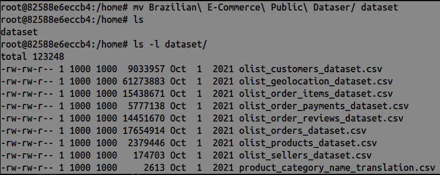
4. Login into database and import schema (**ddl.sql**) into tables.
- Login: `psql -U user1 -d brazilian_ecommerce`
- Import CSV
- `copy global.olist_customers_dataset from '/home/dataset/olist_customers_dataset.csv' with delimiter ',' csv header;`
- `copy global.olist_geolocation_dataset from '/home/dataset/olist_geolocation_dataset.csv' with delimiter ',' csv header;`
- `copy global.olist_order_items_dataset from '/home/dataset/olist_order_items_dataset.csv' with delimiter ',' csv header;`
- `copy global.olist_order_payments_dataset from '/home/dataset/olist_order_payments_dataset.csv' with delimiter ',' csv header;`
- `copy global.olist_order_reviews_dataset from '/home/dataset/olist_order_reviews_dataset.csv' with delimiter ',' csv header;`
- `copy global.olist_orders_dataset from '/home/dataset/olist_orders_dataset.csv' with delimiter ',' csv header;`
- `copy global.olist_products_dataset from '/home/dataset/olist_products_dataset.csv' with delimiter ',' csv header;`
- `copy global.olist_sellers_dataset from '/home/dataset/olist_sellers_dataset.csv' with delimiter ',' csv header;`
- `copy global.product_category_name_translation from '/home/dataset/product_category_name_translation.csv' with delimiter ',' csv header;`

D. Prepare DBT
1. Create python virtual environment using command: `python3 -m venv dbt_retail`
2. Activate virtual environment: `source dbt_retail/bin/activate`
3. Install DBT libraries
- `pip3 install dbt-core`
- `pip3 install dbt-postgres`
- `dbt --version` (to ensure dbt are installed)
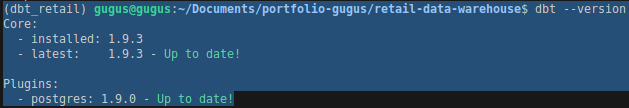
4. Initiate DBT project: `dbt init`
- Enter a name for your project (letters, digits, underscore): **retail_warehouse**
- Which database would you like to use? Choose number 1 (postgres)
- host (hostname for the instance): **localhost**
- port [5432]: **1818**
- user (dev username): **user1**
- pass (dev password): **12345##12345**
- dbname (default database that dbt will build objects in): **brazilian_ecommerce**
- schema (default schema that dbt will build objects in): **global**
- threads (1 or more) [1]: **10** (total of parallel query process, can be customized)
- Output: **Profile retail_warehouse written to /path/to/.dbt/profiles.yml**
5. Copy **profiles.yml** to DBT project (retail_warehouse): `cp /path/to/.dbt/profiles.yml retail_warehouse/`
6. Enter to DBT project: `cd retail_warehouse/`
7. Check connection between DBT and database based on config (**profiles.yml**) using command: `dbt debug` (Ensure all checks passed)
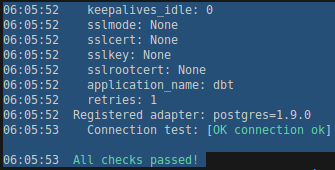

E. Create Data Modelling
1. In retail_warehous/models/, create 3 layers of driectory: `mkdir -p models/raw models/intermediate models/mart`
- raw: store raw data from database
- intermediate: create data models based on BI/Data Analyst requirements
- mart: store the result of analytics
2. Create **source.yml** in **models/** directory, it used to mapping source.
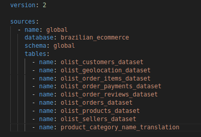
3. Create raw model (9 tables): `touch models/raw/raw_customer.sql models/raw/raw_geolocation.sql models/raw/raw_order_items.sql models/raw/raw_order_payments.sql models/raw/raw_order_reviews.sql models/raw/raw_orders.sql models/raw/raw_product.sql models/raw/raw_sellers.sql models/raw/raw_product_category_name.sql`
4. Create intermediate model using STAR schema (models/intermediate/)
- Fact Table: **fact_orders.sql**
- Dim Tables: **dim_customer.sql**, **dim_product.sql**, **dim_seller.sql**, **dim_review.sql**
5. Create index based on intermediate models in **retail_warehouse/macros/**
- `touch macros/create_indexes.sql`
6. Modified interview models, especially model which contain indexes (**models/intermediate/fact_orders.sql**).
7. Create mart models for BI needs. There are three output:
- **sales_revenue_analysis.sql**: Daily revenue, order count, and products sold
- **delivery_performance_analysis.sql**: Review score distribution and its relationship with delivery delays
- **customer_reviews_analysis.sql**: Review score distribution and its relationship with delivery delays
- **monthly_seller_revenue_analysis.sql**: How many orders has each seller received
- **top_product_analysis.sql**: Which product categories have the top 100 most ordered products

F. Build DBT
1. Check config in **retail_warehouse/dbt_project.yml**. Ensure **model-paths** and **models** declared well.
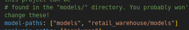
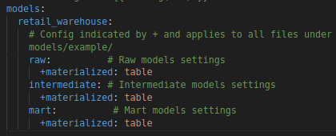
2. (Optional) For rebuild if there is a change in DBT process, use command: `dbt clean`
3. Build: `dbt run`
4. Generate UI docs: `dbt docs generate`
5. Display with UI: `dbt docs serve --port 8081` (To access from your browser, navigate to: http://localhost:8081, port can be customized)
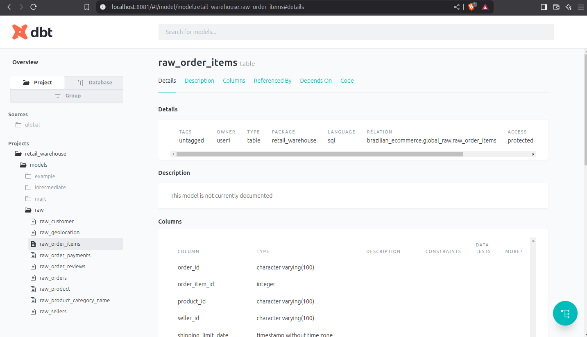
##### Lineage Graph
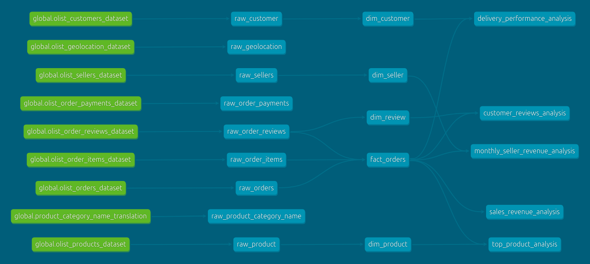

G. Prepare for Data Visualization
1. Run Metabase container and connect wirh PostgreSQL container: `docker run -d -p 3131:3000 --name metabase-retail --link postgres-retail:postgres metabase/metabase`
2. Configure metabase to connect to PostgreSQL, open **http://localhost:3131** in browser
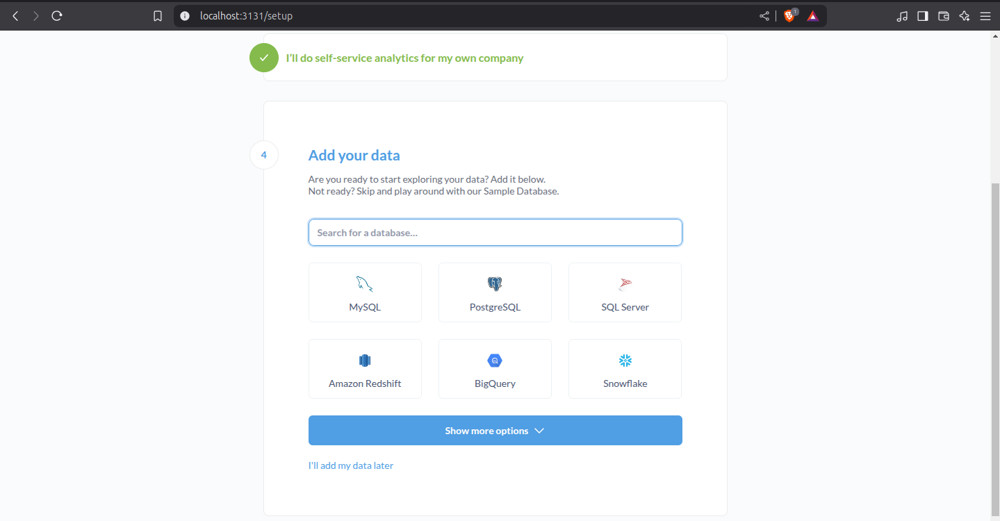
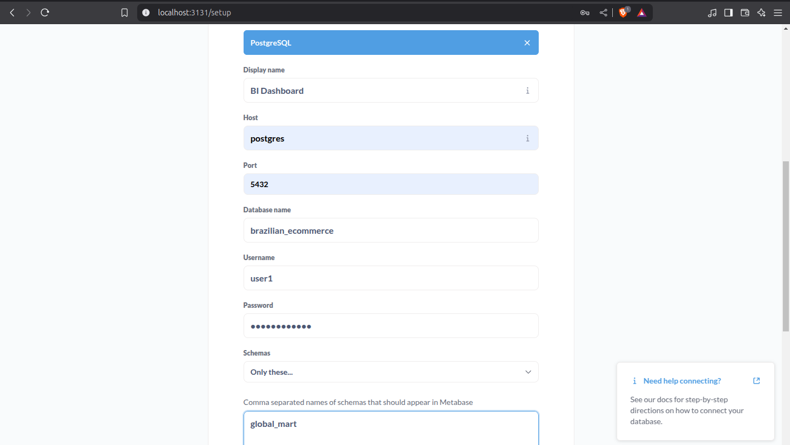
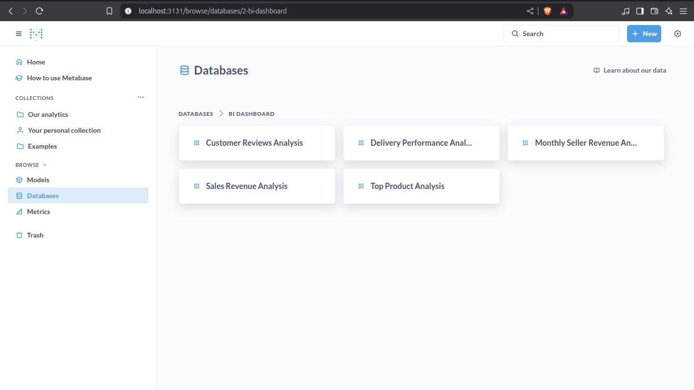
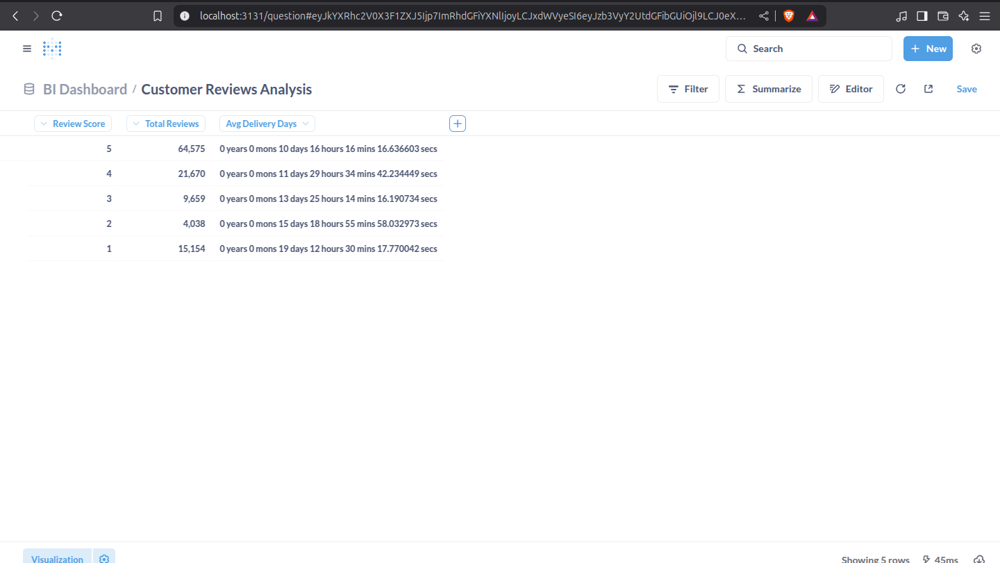
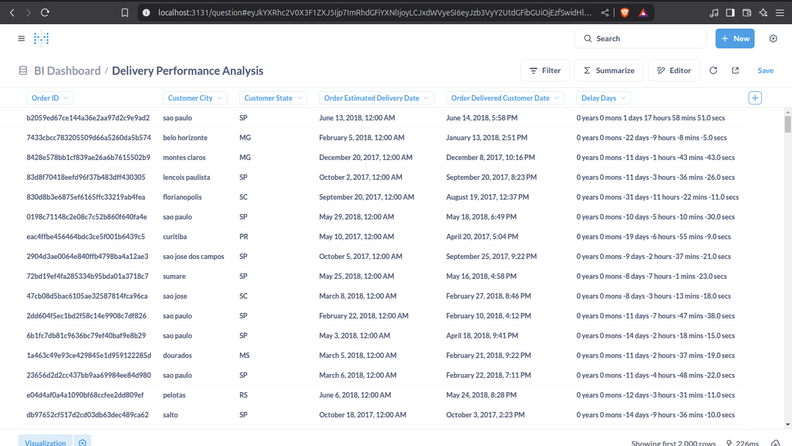
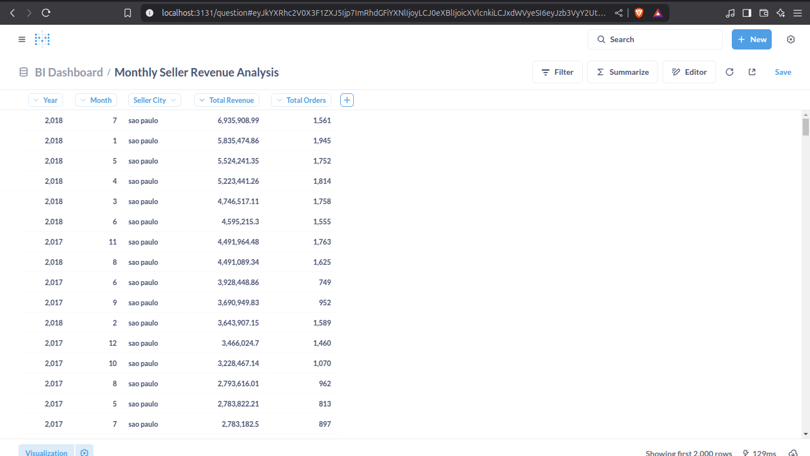
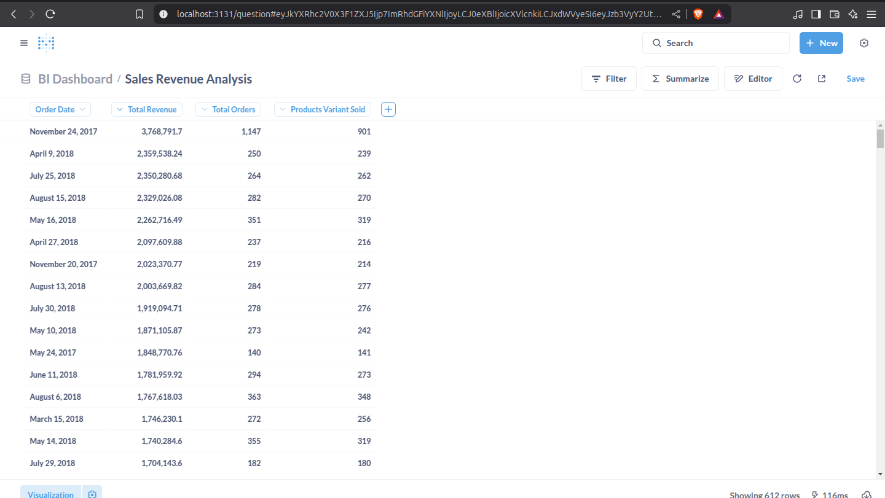
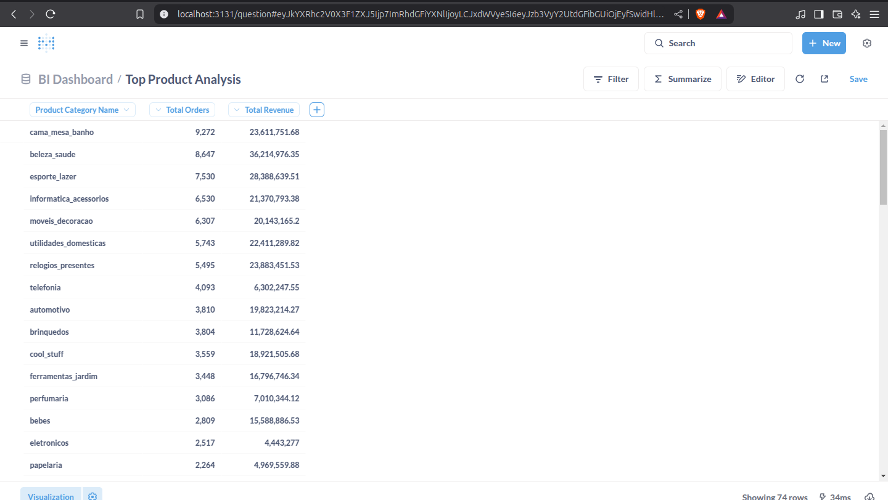